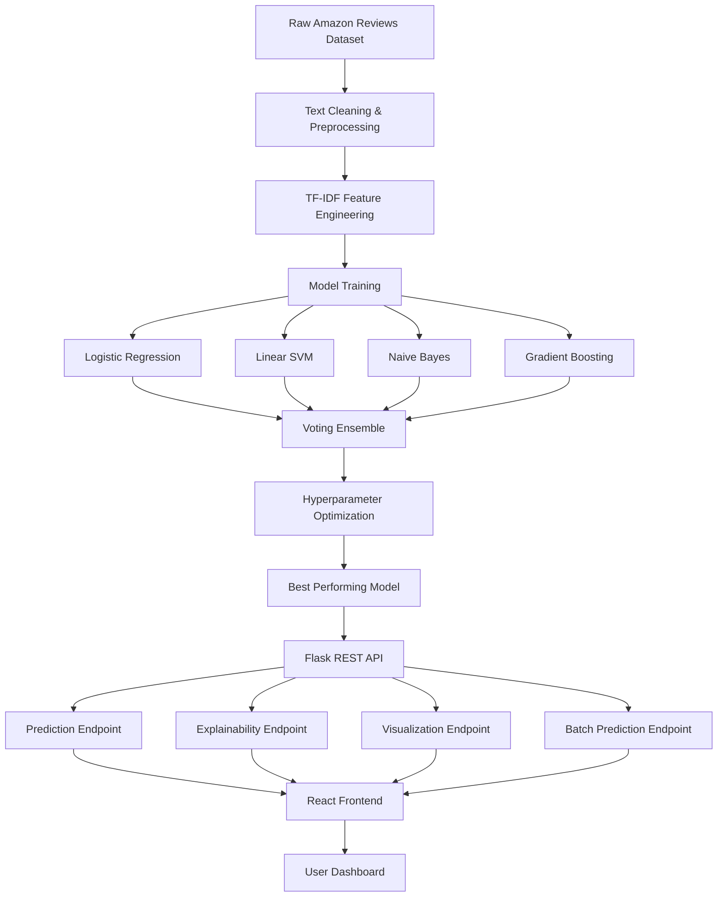

# Explainable AI Fake Review Detection Platform using NLP and Ensemble Machine Learning

An end-to-end Explainable AI (XAI) platform designed to identify fraudulent e-commerce reviews using Natural Language Processing (NLP), ensemble machine learning models, and SHAP-based interpretability.

The system combines advanced text preprocessing, TF-IDF feature engineering, multiple machine learning algorithms, ensemble learning, model explainability, and a modern full-stack web interface to provide transparent and accurate fake review detection.

---

## Overview

Online reviews significantly influence purchasing decisions across e-commerce platforms. However, fake and manipulated reviews reduce consumer trust and negatively impact marketplace integrity.

This project addresses that challenge by building an Explainable AI platform capable of automatically classifying reviews as Genuine or Fake while providing transparent explanations behind every prediction.

Unlike traditional black-box classifiers, this system integrates SHAP explainability to help users understand which words and features influenced model decisions.

---

## Key Features

### NLP-Powered Review Classification

- Detects fake and genuine reviews using Natural Language Processing.
- Processes raw review text in real time.
- Supports large-scale review analysis.

### Ensemble Machine Learning

Combines multiple machine learning algorithms:

- Logistic Regression
- Linear Support Vector Machine (SVM)
- Multinomial Naive Bayes
- Gradient Boosting

Voting-based ensemble learning improves robustness and prediction quality.

### Explainable AI (XAI)

- SHAP (SHapley Additive Explanations) integration.
- Highlights influential words and phrases.
- Makes model predictions transparent and interpretable.

### Hyperparameter Optimization

- GridSearchCV-based tuning.
- Automated parameter search.
- Improved model generalization.

### Interactive Analytics Dashboard

- Prediction confidence visualization.
- Model comparison visualizations.
- Performance analytics.

### REST API Architecture

Flask-based backend provides:

- Real-time predictions
- Explainability endpoints
- Visualization endpoints
- Batch processing capabilities

### Modern Full-Stack Interface

Frontend built using:

- React
- Vite
- TailwindCSS

Provides an intuitive user experience for review analysis.

---

## Business Problem

Fake reviews create several challenges:

- Misleading consumers
- Reduced marketplace trust
- Artificial product ranking manipulation
- Increased fraud risk

This platform helps:

- Consumers identify suspicious reviews
- Businesses maintain review integrity
- E-commerce platforms improve trustworthiness
- Researchers study review authenticity

---

## System Architecture



---

## Machine Learning Pipeline

### Step 1 — Data Collection

Amazon review datasets containing:

- Genuine Reviews
- Fake Reviews

The dataset is transformed into a binary classification problem.

```text
Fake Review → 0
Real Review → 1
```

---

### Step 2 — Text Preprocessing

The review text undergoes:

- Lowercasing
- Stopword removal
- Noise reduction
- Tokenization
- Feature extraction preparation

---

### Step 3 — Feature Engineering

TF-IDF Vectorization

Configuration:

```python
max_features = 20000
ngram_range = (1,2)
min_df = 3
max_df = 0.9
sublinear_tf = True
```

Benefits:

- Captures word importance
- Reduces noise
- Handles large vocabulary efficiently

---

### Step 4 — Model Training

Multiple models are trained independently.

#### Logistic Regression

Advantages:

- Fast inference
- High interpretability
- Strong baseline performance

---

#### Linear SVM

Advantages:

- Effective for text classification
- Strong decision boundaries
- High-dimensional feature support

---

#### Multinomial Naive Bayes

Advantages:

- Fast training
- Suitable for sparse text features

---

#### Gradient Boosting

Advantages:

- Learns complex relationships
- Reduces prediction bias

---

### Step 5 — Ensemble Learning

A voting-based ensemble combines predictions from:

```text
Logistic Regression
+
Linear SVM
+
Naive Bayes
+
Gradient Boosting
```

Benefits:

- Better robustness
- Improved generalization
- Reduced variance

---

### Step 6 — Hyperparameter Tuning

GridSearchCV optimization:

```python
C
max_features
ngram_range
max_iter
```

Used to maximize validation performance.

---

### Step 7 — Explainable AI

SHAP explanations provide:

- Feature contribution scores
- Positive indicators
- Negative indicators
- Word-level importance

Example:

```text
"excellent"  → Real Review Signal

"best product ever"
"100% guaranteed"
"must buy"
→ Fake Review Signals
```

---

## Model Performance

### Final Results

| Metric | Score |
|----------|--------|
| Accuracy | 89.87% |
| ROC-AUC | 0.96 |
| Precision | ~90% |
| Recall | ~90% |
| F1 Score | ~89% |

---

## Model Comparison

| Model | Accuracy |
|----------|----------|
| Logistic Regression | 89.5% |
| Linear SVM | 90.0% |
| Naive Bayes | 88.0% |
| Ensemble | 89.8% |
| Tuned Model | 89.9% |

---

## Performance Visualizations

### Confusion Matrix

Demonstrates classification performance between:

- Fake Reviews
- Genuine Reviews

---

### ROC Curve

AUC Score:

```text
0.96
```

Indicates excellent discrimination capability.

---

### Precision Recall Curve

Shows strong precision retention even at higher recall levels.

---

### Learning Curve

Demonstrates:

- Stable convergence
- Good generalization
- Limited overfitting

---

## API Endpoints

### Predict Review

```http
POST /predict
```

Request:

```json
{
  "review": "This product is amazing and worth every penny."
}
```

Response:

```json
{
  "prediction": 1,
  "result": "Real Review",
  "confidence": 0.93
}
```

---

### Explain Prediction

```http
POST /explain
```

Returns:

- Important words
- SHAP values
- Feature contributions

---

### Generate Visualization

```http
POST /visualize
```

Returns:

- Confidence charts
- Model comparison graphs

---

### Batch Prediction

```http
POST /batch-predict
```

Supports bulk review analysis.

---

## Technology Stack

### Programming Language

- Python

### Machine Learning

- Scikit-Learn
- SHAP
- Joblib

### NLP

- TF-IDF
- N-Grams
- Text Vectorization

### Deep Learning

- PyTorch
- Transformers
- BERT (Experimental Pipeline)

### Backend

- Flask
- Flask-CORS

### Frontend

- React
- Vite
- TailwindCSS

### Visualization

- Matplotlib
- Seaborn

---

## Project Structure

```text
xai-fake-review-detection/

├── frontend/
│   ├── src/
│   ├── public/
│   └── package.json
│
├── backend/
│   ├── api/
│   │   ├── app.py
│   │   └── requirements.txt
│   │
│   └── model/
│       ├── train_model.py
│       ├── review_pipeline.pkl
│       ├── shap_explainer.pkl
│       └── results/
│
├── dataset/
│
├── README.md
└── LICENSE
```

---

## Installation

### Clone Repository

```bash
git clone https://github.com/BrahmjeetSinghMatharu/xai-fake-review-detection.git
```

---

### Backend Setup

```bash
cd backend/api

python -m venv venv

source venv/bin/activate
```

Windows:

```bash
venv\Scripts\activate
```

Install dependencies:

```bash
pip install -r requirements.txt
```

Run API:

```bash
python app.py
```

Backend runs at:

```text
http://localhost:8000
```

---

### Frontend Setup

```bash
cd frontend

npm install

npm run dev
```

Frontend runs at:

```text
http://localhost:5173
```

---

## Future Improvements

### Transformer Fine-Tuning

- DistilBERT
- RoBERTa
- DeBERTa

### Multi-Language Review Analysis

Support:

- English
- Hindi
- Spanish
- French

### Cloud Deployment

- AWS
- Azure
- GCP

### Model Monitoring

Track:

- Drift
- Accuracy decay
- Prediction quality

### Real-Time Browser Extension

Detect suspicious reviews directly on e-commerce websites.

---

## Potential Applications

- Amazon Review Verification
- E-Commerce Fraud Detection
- Marketplace Trust Systems
- Customer Feedback Analysis
- Review Moderation Platforms
- Product Reputation Monitoring

---

## Author

### Brahmjeet Singh

Computer Science Engineering Student

AI/ML | NLP | Explainable AI | Machine Learning Engineering

---

## License

Released under the MIT License.

---

⭐ If you found this project useful, consider starring the repository.
